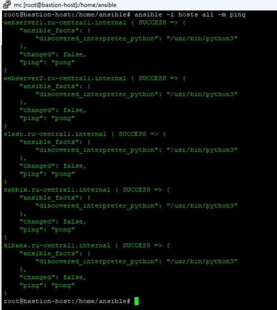
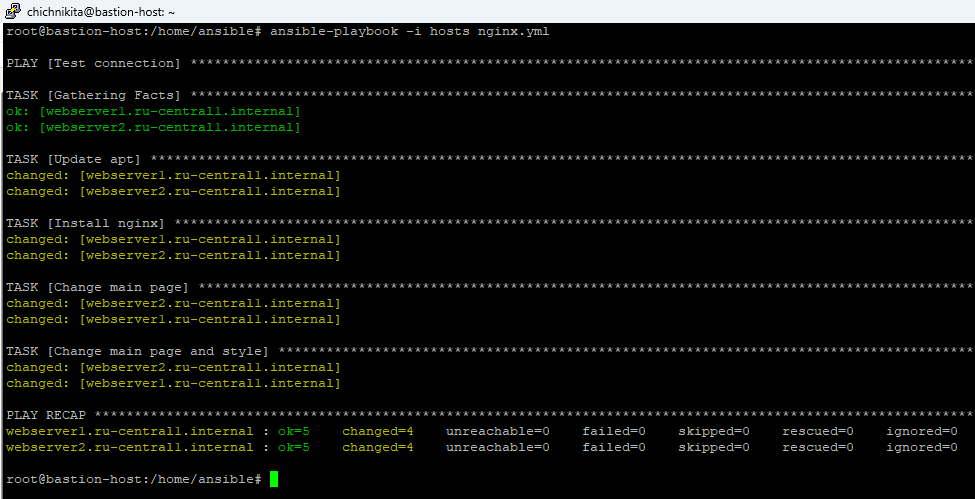
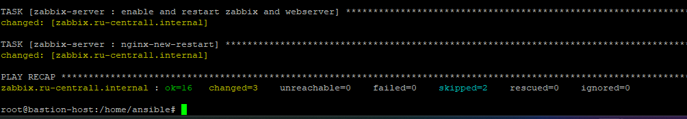

#  Дипломная работа по профессии «Системный администратор»

Техническое задание : [Диплом sys-22](https://github.com/chichnikita/DiplomNetology/blob/main/Read_tx.md)  
Данный по подключениям к серверам : [INFO](https://github.com/chichnikita/DiplomNetology/blob/main/info.md)

## Инфраструктура
Для развёртки инфраструктуры использую Terraform и Ansible.
 * Terraform - смотрите terraform/main.ft и все прилагающие к нему файлы
 * Описывать метод подключения terraform к yandex cloud не буду - все было в лекциях, вебинарах и домашних заданиях, там все очень грамматно и четко показывали и объясняли.

Использовал следующий принцип работы, создал два каталога, на одном стоит сервер terraform, на другом разваричиваются сервера из terraform.

   

## Разворачиваем инфраструктуру используя Terraform 
   
   
   
   
   
   
   
Использовал минимальные конфигурации ВМ:2 ядра 20% Intel ice lake, 2-4Гб памяти, 10hdd, прерываемая.
## Проверяем параметры созданых виртуальных машин
   

Отдельно я создал сервер bastion-host он ничем не отличается от bastion-host1. Это была временна необходимость, так как при использовании команды terraform destcroy - удалялся сервер с bastion-host1(где лежит весь ansible).
Для того, что каждый раз не перекидывать файлы и заново устаналивать ansible и я поступил таким образом.
## Сайт
### Проверяем созданую Target Group

### HTTP router

### Backend Group

### Balancer

### Проверяем созданую группу безопасности

### С помощью Ansible проверяем доступность созданых виртуальных машин
  
### Для ansible inventory использовал fqdn имена виртуальных машин в зоне ".ru-central1.internal"  
   

### Устанавливаем Nginx на машины

### Тестируем сайт `curl -v <публичный IP балансера>:80` 

### Проверяем корректность работы balancer

## Мониторинг
### Устанавливаем zabbix-server на машину

### Установиваем Zabbix Agent на web-server1, web-server2 и настраиваем агенты на отправление метрик в Zabbix.

### Настраиваем дешборды с отображением метрик, минимальный набор — по принципу USE (Utilization, Saturation, Errors) для CPU, RAM, диски, сеть, http запросов к веб-серверам.

## Логи
### Устанавливаем elasticsearch на сервера web-server1, web-server2

### Устанавливаем filebeat

### Устанавливаем kibana

   
## Резервное копирование
### Создаем snapshot

