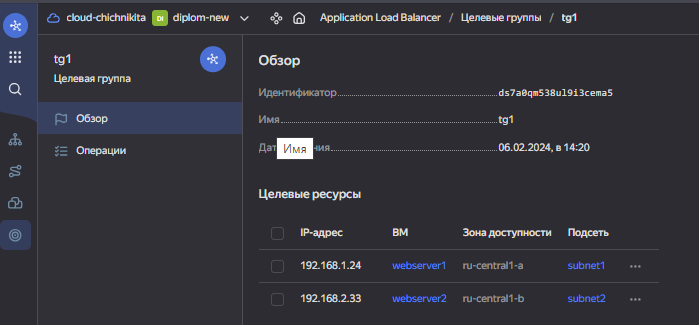
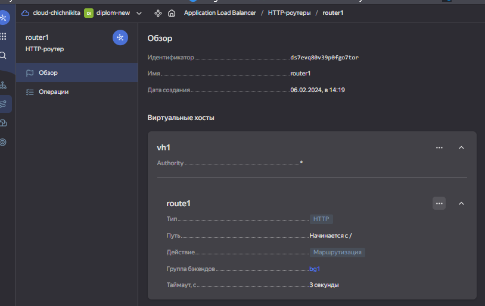
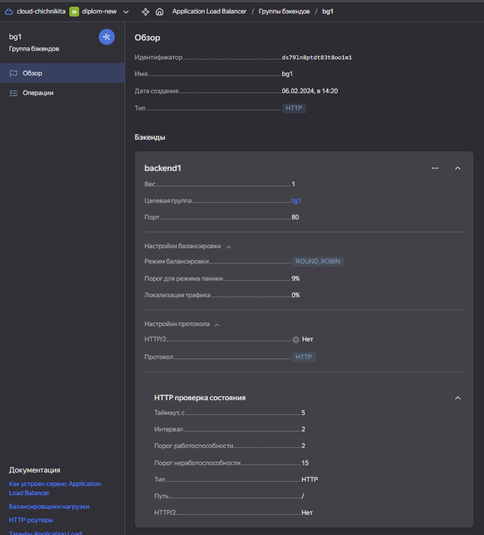
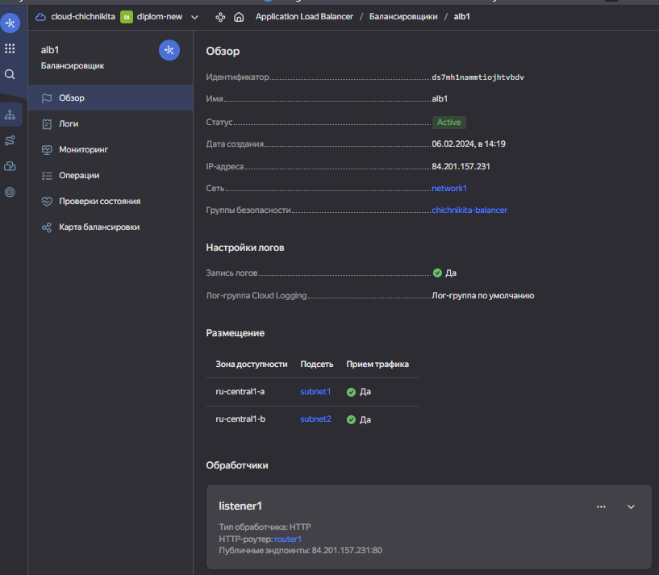
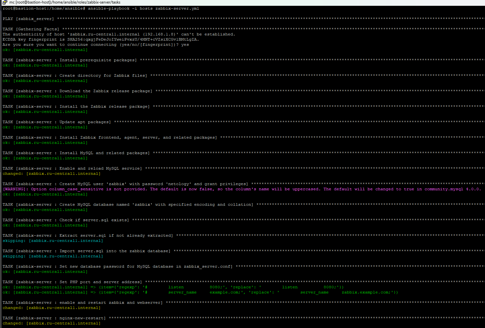

#  Дипломная работа по профессии «Системный администратор»

Техническое задание : [Диплом sys-22](https://github.com/chichnikita/DiplomNetology/blob/main/Read_tx.md)  
[Информация по подключениям к серверам ](https://github.com/chichnikita/DiplomNetology/blob/main/info.md)

## Инфраструктура
Для развёртки инфраструктуры использую Terraform и Ansible.
 * Terraform - смотрите terraform/main.ft и все прилагающие к нему файлы
 * Описывать метод подключения terraform к yandex cloud не буду - все было в лекциях, вебинарах и домашних заданиях, там все очень грамматно и четко показывали и объясняли.

 

Использовал следующий принцип работы, создал один каталог bastion-new -  на нём сервер terraform. При развертывание terraform, вся инфраструктура разворачивается в другом катологе diplom-new.

   

## Разворачиваем инфраструктуру используя Terraform 
   
   
   
   
   
   
   
Использовал минимальные конфигурации ВМ:2 ядра 20% Intel ice lake, 2-4Гб памяти, 10hdd, прерываемая.
## Проверяем параметры созданых виртуальных машин
  

Виртуальная машина github - это личный сервер, к проекту он не имеет никакого отношения :) 

## Сайт
### Проверяем созданую Target Group

 
   

 
   
### HTTP router

 
   

 
   
### Backend Group

 
   

 

### Balancer

 

 

### Проверяем созданую группу безопасности

 

 

### С помощью Ansible проверяем доступность созданых виртуальных машин

 

 

### Для ansible inventory использовал fqdn имена виртуальных машин в зоне ".ru-central1.internal"  

 

 

### Устанавливаем Nginx на машины

 

 

### Тестируем сайт `curl -v <публичный IP балансера>:80` 

[Информация по подключениям к серверам ](https://github.com/chichnikita/DiplomNetology/blob/main/info.md)

 
   

 

### Проверяем корректность работы balancer

 

 

## Мониторинг
### Устанавливаем zabbix-server на машину 
[Информация по подключениям к серверам ](https://github.com/chichnikita/DiplomNetology/blob/main/info.md)

 

 

### Установиваем Zabbix Agent на web-server1, web-server2 и настраиваем агенты на отправление метрик в Zabbix.

 

 

### Настраиваем дешборды с отображением метрик, минимальный набор — по принципу USE (Utilization, Saturation, Errors) для CPU, RAM, диски, сеть, http запросов к веб-серверам.

## Логи
### Устанавливаем elasticsearch на сервера web-server1, web-server2

 
   

 
   
### Устанавливаем filebeat

 

 

### Устанавливаем kibana

   

 
   
## Резервное копирование
### Создаем snapshot

 

 
  
## Спасибо большое за данный курс и возможность научиться много новому, после защиты диплома собираюсь купить и пройти другие курсы, всем советую!
